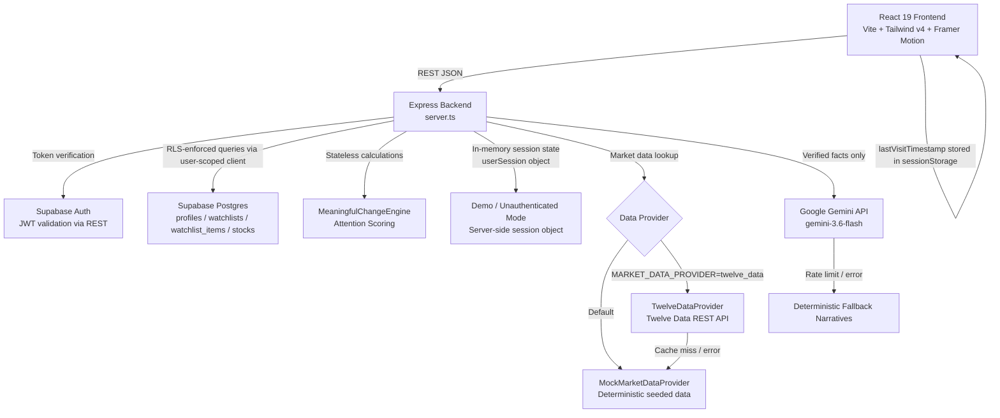
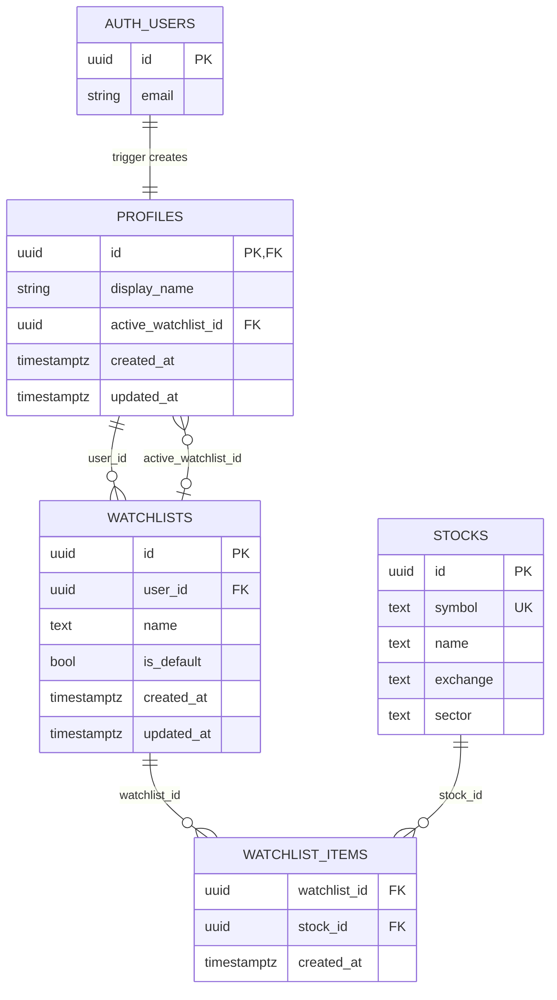

# Nazar - Keep an eye on what matters.

> **Note:** Internal API routes, component filenames, and the repository URL retain the original 'Pulse' identifier; only the product-facing name changed to Nazar.
### Code, by Groww 2026 Submission

Nazar is a smart market watchlist built around a single question: **"What changed while I was away, and does it actually matter?"**

A conventional watchlist answers *"what is the current price?"*. Nazar answers *"what moved, why it moved, and whether that movement is worth your attention right now"* — personalised to the exact window of time since your last visit. It does this through a deterministic, multi-factor Attention Scoring Engine that runs server-side on every request, combined with a per-user price snapshot system that stores where prices were when you last checked.

## LIVE DEPLOYED LINK - https://groww-pulse-iota.vercel.app/


---

## 1. Product Overview

### The Problem with Conventional Watchlists

A standard watchlist shows you current prices. It does not tell you:
- Whether a 2% move happened *during* your absence or *before* it
- Whether that 2% is significant relative to this stock's normal volatility
- Whether volume confirmed the move or not
- Whether a gap-up that subsequently reversed is more important than a steady upward grind
- Which of your 12 tracked stocks actually deserves your attention right now

The result: users scan their entire watchlist on every visit, manually comparing prices they half-remember from yesterday. That cognitive overhead compounds across sessions.

### What Nazar Does Differently

When a user returns to Nazar, the system:
1. **Measures the exact time elapsed** since their last session (or a simulated absence)
2. **Compares current market state against a per-user price snapshot** taken at their last visit — not just against yesterday's close
3. **Runs a proprietary Attention Score** (0–100) for every watched stock, factoring in volume, volatility, technical breakouts, intraday reversals, and the personal delta since the user's last check
4. **Surfaces a ranked, filterable view** of what changed meaningfully, ordered by attention score
5. **Generates a human-readable narrative** (via Google Gemini or deterministic fallback) explaining *why* a move matters in institutional context

The output is a prioritised briefing, not a raw price feed.

### Primary User Journey

```
User visits Nazar
  → Signs in (or skips auth for demo mode)
  → Session records current prices as baseline snapshot
  → User browses the watchlist, then leaves

[Time passes — market moves]

User returns
  → Nazar calculates elapsed time since last visit
  → Compares current prices against stored snapshot prices
  → Runs Attention Engine on every watched stock
  → Presents sorted list: highest-attention stocks first
  → Top Nazar card shows "You were away 7h 42m — 3 things changed meaningfully"
  → User opens any stock → sees "Last seen at ₹2,341 → Now ₹2,431 (+3.8%)" + why it matters
  → User can acknowledge, dismiss, or deep-dive events
  → User taps "Sync Now" → current prices become new baseline
```

---

## 2. Core Features

### Watchlist Management
Create, rename, delete, and switch between multiple named watchlists. Add or remove stocks from a searchable universe (currently 14 symbols across NSE and NASDAQ). The default watchlist auto-initialises with major NIFTY 50 constituents for authenticated users via a PostgreSQL RPC.

### Nazar Hero
The primary entry screen. Surfaces the top 3 highest-attention stocks from the active watchlist, the total count of meaningful changes, and a plain-English summary narrative ("You were away for 7h 42m..."). This is the "what happened while I was away" answer.

### Attention Score (0–100)
Every stock receives a score computed deterministically on every API call. It combines up to five independent signals. Stocks are sorted by score descending. Users can toggle a filter to see only stocks above the attention threshold.

### Per-User Price Delta
Every stock card shows the exact price when the user last visited and the current price — not yesterday's close. The comparison is user-specific, not market-universal.

### Change Timeline
A chronological event feed showing *what happened and when* within the user's absence window. Each event has a mini price chart, an explanation, and can be acknowledged or dismissed. The timeline is scoped to the active watchlist.

### Stock Detail Modal
Deep-dive on any stock: multi-timeframe SVG price charts (1D/1W/1M/1Y/ALL), day OHLC, 52-week range, 30-day range, market cap, P/E, volume analysis, and the AI-generated or fallback narrative explaining the move.

### AI Explanation Layer (Google Gemini)
For high-attention stocks, Gemini `gemini-3.6-flash` generates a concise 1–2 sentence explanation of the price action. Critically, the AI receives only pre-computed, deterministic facts — it is used only as a natural-language renderer, never as a data source. Hallucinations of financial figures are structurally prevented. If Gemini is unavailable or rate-limited, deterministic fallback narratives are served with no user-visible impact.

### Time Travel Simulator
A developer/demo tool that sets the simulated `lastVisitTimestamp` to a chosen distance in the past (15m, 2h, 7h 42m, 24h, 3 days). It also adjusts the per-user price snapshot to match that moment, so the entire Attention Engine reacts as if the user genuinely was away for that period. This allows the full "you were away" flow to be demonstrated without waiting.

### Authentication + Demo Mode
Full Supabase Auth (email/password) with server-side JWT verification. All watchlist endpoints enforce Row-Level Security so users can only access their own data. A "Skip For Now" button activates in-memory demo mode, bypassing auth entirely and using a server-side session object — useful for reviewers.

---

## 3. What Counts as a "Meaningful Change"?

This is the core engineering problem Nazar addresses. The answer is implemented in `MeaningfulChangeEngine.calculateAttention()` in [`server/marketEngine.ts`](./server/marketEngine.ts).

### Scoring Model

Every stock starts at a baseline score of **20**. Five independent factors can add points. The score is capped at **98** for realism (a score of 100 would imply perfect information).

| Factor | Condition | Points Added |
|--------|-----------|-------------|
| **Volume Surge** | Volume ≥ 2.0× 30-day average | `min(35, round(ratio × 14))` |
| **Elevated Volume** | Volume between 1.4×–1.99× average | +15 |
| **Volatility Shock** | Price move ≥ 2.5× the stock's historical daily volatility | `min(30, round(multiple × 10))` |
| **Price Momentum** | Absolute price change ≥ 1.5% | +15 |
| **30-day High Breakout** | Current price ≥ 30-day high | +28 |
| **Near-High** | Within 1.5% of 30-day high | +18 |
| **Intraday Gap Reversal** | Opened >0.8% above close, then fell >1.5% below close | +26 |
| **User Delta** | Price moved ≥ 2.5% since user's last visit (personal) | +16 |

**Score → Level mapping:**
- ≥ 75: `high` (shows in Nazar hero, top priority)
- 50–74: `medium`
- < 50: `low`

### Why These Signals?

**Volume is a conviction proxy.** A 3% price move on 2.4× normal volume means institutional participants were actively involved. The same 3% move on 0.8× volume is speculative noise. Volume weighting is the single most important differentiator from a naive percentage-change sort.

**Volatility normalisation prevents misleading rankings.** A 2% move in HDFCBANK (typical daily range: 1.45%) is a 1.38× volatility event. A 2% move in BHARTIARTL (typical daily range: 1.10%) is a 1.82× volatility event. Raw percentage ranking would treat these equally; the scoring engine doesn't.

**The 30-day high breakout is a level that the market has repeatedly tested and failed to sustain.** When price clears it with volume, that's technically significant. This is a standard institutional trigger level.

**The intraday gap reversal is specifically a bearish signal.** A stock that opens higher (gap-up) but closes below the previous day's close on high volume signals strong distribution — institutional selling into retail optimism. This is one of the highest-information patterns for risk management. It warrants +26 points because the signal is specific, time-bounded, and not captured by simple daily percentage change.

**The user-personal delta** ensures that a stock which moved sideways for two days and then surged during *your specific* absence gets credit for that surge relative to your snapshot — even if the 24-hour change number looks modest.

### What is Not Counted as Meaningful

- Normal range fluctuation below thresholds
- News events without price/volume confirmation (no news API is integrated)
- Options data, FII/DII flows, or order book depth (not in the current data model)

---

## 4. User Experience

### Auth Flow
Landing screen presents email/password sign-in and sign-up. A "Skip for now" link at the bottom of the card activates demo mode — the user enters the full application immediately using server-side in-memory session data.

### Navigation
Four tabs in the header: **Nazar** (briefing + watchlist), **Watchlist** (watchlist standalone), **Timeline** (chronological event feed), **Indices** (NIFTY 50, SENSEX, BANK NIFTY, GIFT NIFTY cards).

### Demo Mode Banner
A persistent top bar indicates demo mode is active, displays the canonical scenario summary, and provides a "Reset Demo" button to restore the canonical 7h 42m scenario if the user has changed the time travel setting.

### Watchlist View
Stocks are listed as rows with: symbol, company name, sector badge, current price, 24h change, attention score chip (colour-coded), a 24-point sparkline, and the personal delta chip ("since your last visit"). Rows are sortable by attention score. High-attention stocks float to the top.

### Stock Card → Why Modal
Each stock card has a "Why?" button that opens the `AttentionWhyModal`. This explains the score factors with individual point contributions and the AI/fallback narrative.

### Command Search
`Cmd/Ctrl+K` opens a keyboard-driven command palette for searching stocks, adding/removing from the current watchlist, and navigating.

---

## 5. System Architecture



### Component Responsibilities

| Component | Responsibility |
|-----------|---------------|
| `server.ts` | Express router; all API endpoints; Vite dev middleware integration; demo/time-travel session management |
| `server/marketEngine.ts` | Attention Scoring Engine, `MarketDataProvider` façade, `UserSessionState`, narrative generation, index and event data |
| `server/supabaseRepo.ts` | All Supabase database operations; creates user-scoped clients per request to enforce RLS; admin client for stock seeding |
| `server/authMiddleware.ts` | JWT Bearer token extraction; Supabase Auth verification; demo-mode bypass |
| `server/providers/` | `IMarketDataProvider` interface implementations; `TwelveDataProvider` (live, with 60s cache + stale fallback); `MockMarketDataProvider` (deterministic) |
| `src/services/api.ts` | Frontend API client; injects the Supabase session token on every request automatically |
| `src/contexts/AuthContext.tsx` | Supabase auth state listener; exposes `isDemoMode`, `user`, `session`; `setDemoMode()` for the skip-auth flow |
| `src/components/` | Stateless React UI components; receive data as props |

---

## 6. Technology Stack

| Layer | Technology | Reason |
|-------|-----------|--------|
| Frontend framework | React 19 | Concurrent features, stable ecosystem |
| Build tool | Vite 6 | Sub-second HMR, ESM-native, unified dev server |
| Backend framework | Express 4 | Minimal, well-understood, no magic |
| Language | TypeScript 5.8 | Full-stack type safety; shared `types.ts` between frontend and backend |
| Styling | Tailwind CSS v4 | Utility-first; CSS variable design tokens for theming |
| Animations | Framer Motion (motion/react) | Declarative `AnimatePresence` for modal transitions and stagger effects |
| Database | Supabase (Postgres) | Managed Postgres with built-in Auth and Row-Level Security; eliminates a separate auth service |
| Authentication | Supabase Auth | Email/password with JWT; JWTs verified server-side on every request |
| AI / LLM | Google Gemini (gemini-3.6-flash) | Narrative text only; structured fact injection prevents hallucination |
| Live market data (optional) | Twelve Data REST API | Clean, affordable, supports multi-symbol batching |
| Default market data | Deterministic mock provider | Zero API dependency for demos; realistic, seeded data |
| Icons | Lucide React | Consistent, lightweight |
| Dev runner | tsx (ts-node equivalent) | Runs TypeScript server directly in dev without a build step |
| Production build | esbuild (via Vite) | Fast CJS bundle for server; SPA bundle for frontend |

---

## 7. Data Flow

### A. User Loads a Watchlist

```
Frontend: loadMarketData()
  → GET /api/watchlists (with Bearer token)
     → authMiddleware validates JWT with Supabase Auth
     → supabaseRepo.getWatchlists(token)
        → Creates user-scoped Supabase client (RLS enforced)
        → Calls ensure_default_watchlist() RPC (idempotent)
        → Fetches watchlists + nested watchlist_items + stocks via Supabase join query
        → Fetches active_watchlist_id from profiles table
        → Returns formatted watchlists array + activeId
  → GET /api/market/stocks?watchlistId=X
     → marketEngine.getStocks(symbols)
        → For each symbol: computes attention score, user delta, sparkline, narrative
     → Returns enriched Stock[] array
  → GET /api/market/pulse?watchlistId=X
  → GET /api/market/events?watchlistId=X
  → GET /api/market/indices

Frontend: updates all state, re-renders, polls again in 15 seconds
```

### B. User Adds a Stock

```
Frontend: handleAddStock(symbol)
  → PUT /api/watchlists/:id { symbols: [...existing, newSymbol] }
     → supabaseRepo.updateWatchlist(token, id, undefined, newSymbols)
        → Calls replace_watchlist_items() RPC atomically
           → Deletes all existing watchlist_items for this watchlist
           → Re-inserts all items (including new symbol) by resolving symbol → stock UUID
           → All inside a single PL/pgSQL function for atomicity
  → Frontend re-calls loadMarketData(activeWatchlistId)
```

Note: add/remove is implemented as a full symbol-set replace via an atomic RPC. This eliminates partial-write races.

### C. User Returns After Absence

The "return" flow is implicit — the attention engine does the work on every `/api/market/stocks` call.

```
userSession.lastVisitTimestamp   ← set when user last synced (or on session init)
userSession.userStockSnapshots   ← { symbol: { price, timestamp } } for each stock

GET /api/market/stocks
  → For each stock:
     previousPrice = userStockSnapshots[symbol].price
     currentPrice  = BASE_STOCKS[symbol].basePrice  (or TwelveData if live)
     priceDiff     = currentPrice - previousPrice
     percentDiff   = (priceDiff / previousPrice) × 100
     awayStr       = formatDuration(simulatedAwaySeconds)
  → MeaningfulChangeEngine.calculateAttention() runs with previousPrice
  → Stock returned with attentionScore + userDelta { previousPrice, currentPrice, percentDiff, narrative }

Frontend sorts stocks by attentionScore descending
MarketPulseHero shows top 3 high-attention stocks + "You were away for X"
```

### D. Market Data API Fails or Becomes Stale

The `TwelveDataProvider` handles failures in two layers:

1. **60-second in-memory quote cache.** If an API call succeeds, the result is cached. If the next call fails within 60 seconds, the cached (potentially stale) result is returned silently.

2. **Stale cache fallback.** If a symbol is not in cache and the API fails (HTTP error, network error, or `429` rate limit), the provider calls `fallbackToStaleCache()` — which serves the most recent expired cache entry if available, or falls back to `MockMarketDataProvider` data for that symbol.

3. **`429` rate-limit handling.** Twelve Data rate-limit responses are explicitly checked by status code. The error is logged but not surfaced to the user.

The `FeedStatus` endpoint (`/api/market/status`) reports the current mode (`LIVE` or `DELAYED`) so the frontend can show a data-freshness indicator to users.

If the backend itself crashes, the frontend catches the `loadMarketData` error and logs it — the UI remains at whatever state it last successfully loaded (no hard crash, no blank screen).

---

## 8. Persistence & State Management

### Authenticated Users (Supabase)

| What | Where | How |
|------|-------|-----|
| Watchlist structure (name, symbols) | Supabase `watchlists` + `watchlist_items` tables | Persists across sessions and devices |
| Active watchlist selection | Supabase `profiles.active_watchlist_id` | Updated on every watchlist switch |
| Stock master data | Supabase `stocks` table | Seeded on server startup via admin client |
| User identity | Supabase Auth (email/password, JWT) | Standard token refresh flow |

### Demo Mode (In-Memory)

| What | Where | How |
|------|-------|-----|
| Watchlists | `userSession.watchlists` (Node.js process memory) | Lost on server restart |
| Active watchlist | `userSession.activeWatchlistId` | Same |
| Per-user price snapshot | `userSession.userStockSnapshots` | Stores { price, timestamp } per symbol |
| Last visit timestamp | `userSession.lastVisitTimestamp` | Unix ms; controls away-duration calculation |
| Dismissed/acknowledged events | `userSession.dismissedEventIds` / `acknowledgedEventIds` (Set) | In-memory; reset by demo reset |

### Client-Side

| What | Where |
|------|-------|
| Intro seen flag | `localStorage.pulse_intro_seen` |
| Demo scenario initialised flag | `sessionStorage.pulse_demo_initialized_v2` |
| Auth session token | Supabase client library handles (memory + persisted per Supabase SDK default) |

**Price snapshot baseline** is managed server-side, not in the browser. This means it survives client refreshes and tab switches. The snapshot is updated by the `/api/session/sync` endpoint (triggered by "Sync Now" button), which writes current prices to `userStockSnapshots`.

---

## 9. Reliability & Edge Cases

### Market Data Unavailable
`TwelveDataProvider` falls back to stale cache, then to deterministic mock data. The backend never returns a 500 for a missing quote — it returns the best available approximation. The frontend's `FeedStatus` indicator communicates data freshness.

### API Rate Limits (Twelve Data `429`)
Explicitly handled. The provider catches the `code === 429` response, triggers `fallbackToStaleCache()`, and does not rethrow. Gemini rate limits (`429`) are caught in `MeaningfulChangeEngine.buildStockDeltaNarrative()` — the error branch silently falls through to the deterministic fallback narrative. No quota errors reach the user.

### Stale Market Data
The `FeedStatus` type includes `STALE` and `UNAVAILABLE` modes (defined in `types.ts`). Currently `TwelveDataProvider` reports `LIVE` while `MockMarketDataProvider` reports `DELAYED`. More granular staleness detection (e.g., timestamp age checks) is defined in the type system but not yet wired into the provider response.

### Invalid or Unknown Stock Symbol
`/api/market/stocks/:symbol` returns HTTP 404 if `getStocks()` returns no result for the given symbol. The mock provider only knows about the 14 seeded symbols; Twelve Data search delegates to the Twelve Data search endpoint which is quota-free.

### Duplicate Stock in Watchlist
Prevented client-side: `handleAddStock` checks `wl.symbols.includes(symbol)` before calling the API. Prevented server-side by the `replace_watchlist_items` RPC which does a `DELETE + INSERT ... ON CONFLICT DO NOTHING`.

### Deleting the Only / Default Watchlist
The backend `supabaseRepo.deleteWatchlist()` fetches the watchlist's `is_default` flag before deleting and throws if true. For demo mode, the server checks `userSession.watchlists.length <= 1` and returns HTTP 400.

### Authentication Failure
`authMiddleware.ts` returns HTTP 401 with a structured error body. The frontend's `api.ts` does not currently intercept 401s and redirect — it would surface as a failed data load. The `AuthContext` handles token expiry via Supabase's `onAuthStateChange` listener, which will set `user` to `null` and cause `AuthGate` to render `<AuthScreen />`.

### Concurrent Watchlist Updates
The `replace_watchlist_items` PostgreSQL RPC replaces items atomically inside a single PL/pgSQL transaction. Concurrent calls will serialise at the database level. There is no optimistic locking on the watchlist itself.

### AI Narrative Failure
If Gemini fails for any reason (API error, network timeout, rate limit, malformed response), `buildStockDeltaNarrative()` returns a deterministic string constructed from the pre-computed facts. The user receives a narrative regardless. The `source` field in the response (`gemini` vs `fallback`) is logged server-side.

### Gemini Hallucination Prevention
The Gemini prompt is structured as a strict fact-injection template. The API receives only numbers that were deterministically calculated before the prompt is built. The prompt explicitly instructs the model not to invent any numbers, prices, or events not present in the provided facts. A `maxOutputTokens: 80` cap prevents long, invention-prone responses.

### Known Limitations

- **Server-side session is process-scoped**: In production with multiple Node.js instances, the `userSession` object (demo mode, time travel) is not shared across instances. Authenticated users are not affected since their state is in Supabase.
- **No real-time WebSocket feed**: The frontend polls every 15 seconds. There is no push mechanism for instant price updates.
- **Historical chart data is always mocked**: Even when `MARKET_DATA_PROVIDER=twelve_data` is set, historical chart data (1D/1W/1M/1Y) uses the mock provider to avoid burning API rate limits. This is explicitly noted in `TwelveDataProvider.getHistoricalData()`.
- **Per-user price snapshot is not persisted for authenticated users**: The `userStockSnapshots` object lives in the server's `userSession`. On server restart, authenticated users will lose their previous price baseline. The correct fix would be to persist the snapshot per user in the `profiles` table.
- **14 supported symbols**: The stock universe is limited to 14 pre-seeded symbols. Adding an arbitrary symbol requires adding it to `BASE_STOCKS` in `marketEngine.ts`.
- **Event feed is deterministic**: The Change Timeline events are hardcoded scenarios, not computed from live data.

---

## 10. Engineering Decisions & Trade-offs

### Unified Express + Vite Server

**Decision:** A single Node.js process serves both the Express API and the Vite dev middleware. In production, it serves the built SPA from `dist/`.

**Why:** Eliminates CORS configuration, simplifies deployment (one container, one port), and avoids managing two separate processes during development.

**Trade-off:** The server and frontend are coupled in one process. You cannot independently scale the API from the static file serving layer. For a hackathon where the deployment target is a single container, the simplicity benefit clearly outweighs the scalability cost.

---

### Attention Engine on the Server, Not the Client

**Decision:** All score calculation happens in `server/marketEngine.ts`, not in the browser.

**Why:** The engine needs access to authoritative baseline data (30-day averages, historical volatility, user snapshot prices). Keeping this computation server-side ensures all clients see a consistent score for the same stock, prevents score manipulation via client-side modification, and keeps the type model simple (the client receives a pre-computed `attentionScore` field).

**Trade-off:** Every API call recalculates scores from scratch. There is no incremental update mechanism. For 14 stocks, this is instantaneous. For a watchlist of 200+ stocks, this would become a measurable bottleneck.

---

### `IMarketDataProvider` Interface with Swappable Providers

**Decision:** Market data access is behind a formal interface with two implementations: `MockMarketDataProvider` and `TwelveDataProvider`. The active provider is selected at startup via an environment variable.

**Why:** Decouples the business logic (attention scoring, delta computation) from the data source. This means the demo works without any API key, and switching to live data requires only a two-line `.env` change.

**Trade-off:** The abstraction adds a layer of indirection. More importantly, the `TwelveDataProvider`'s historical data endpoint intentionally throws (fallback is always used), which means the interface contract is partially broken for that method. This is a known limitation documented in the code.

---

### Atomic PostgreSQL RPCs for Watchlist Mutations

**Decision:** Watchlist creation (`create_watchlist_with_items`) and item replacement (`replace_watchlist_items`) are implemented as PL/pgSQL functions called via Supabase RPC, not as sequences of client-initiated API calls.

**Why:** A watchlist update involves deleting all existing items and reinserting the new set. If this is done as two separate API calls, a crash between calls leaves the watchlist in a corrupt empty state. A single PL/pgSQL transaction either fully completes or fully rolls back.

**Trade-off:** Business logic lives in the database, which makes it harder to test in isolation and creates a tight coupling between the application and Supabase specifically. The trade-off was intentional — data integrity was prioritised over portability.

---

### Gemini as an Explanation Layer, Not a Data Source

**Decision:** Gemini receives only pre-computed numerical facts (percentage change, volume ratio, score, detected pattern types). It is asked only to render these facts in natural language. It is never asked to retrieve data, estimate prices, or make predictions.

**Why:** LLMs hallucinate financial numbers. A model that invents a price movement that didn't happen would be actively harmful in a financial context. By structurally separating the deterministic calculation layer from the language rendering layer, hallucinations of financial facts are impossible — the model cannot say a number that wasn't in the prompt because it was instructed not to, and the prompt only contains verified numbers.

**Trade-off:** The narrative is less "intelligent" — Gemini can only rephrase what it was given. It cannot notice patterns, surface context from its training data, or explain macroeconomic causes. That is the correct trade-off: reliability over apparent sophistication.

---

### Demo-First Architecture

**Decision:** The server initialises to a canonical "7h 42m away" state on startup, including pre-set price snapshots and market events. A `POST /api/demo/reset` endpoint restores this state on demand.

**Why:** Hackathon judges need to see the "you were away" experience immediately, without having to wait and come back. The canonical scenario is specifically designed to demonstrate all three attention score paths simultaneously: price surge with volume (RELIANCE), technical breakout (TCS), and intraday reversal (HDFCBANK).

**Trade-off:** The demo state is a fiction. The seeded prices and events are scenarios. This is acceptable for a demonstration submission but would require a complete rethink for production, where the baseline state would come from live data and real user behaviour.

---

## 11. AI / Intelligence Layer

### Where AI Is Used

`POST /api/ai/explain` — accepts a structured `facts` object and returns a single concise sentence of natural language explanation.

`MeaningfulChangeEngine.buildStockDeltaNarrative()` — called during `getStocks()` for high-attention stocks. Uses Gemini if `GEMINI_API_KEY` is configured and the stock's attention level is `high`. Uses deterministic fallback otherwise.

### Input and Output

**Input (facts injected into prompt):**
```
Stock: RELIANCE (Reliance Industries Ltd)
Price change since last visit: +3.80%
Volume: 2.4× 30-day average
Crossed 30-day high resistance
Time since user's last check: 7h 42m
Attention score: 87/100
```

**Output:** A single sentence (≤ 30 words) in plain English, no financial advice language, no invented figures.

### Fallback Handling

A 2-minute in-memory TTL cache (`narrativeCache` Map) prevents redundant Gemini calls for the same stock within a polling window. If Gemini returns an error (network, 429, API error), the function silently uses a deterministic fallback string constructed from the pre-computed facts. If the stock has a hardcoded fallback narrative in `FALLBACK_NARRATIVES` (server.ts), that is returned instead.

### What Is Not AI

The Attention Score (0–100) is **not AI**. It is a deterministic rule-based weighted sum of five signal conditions. Each condition has an explicit threshold and a fixed point value. There is no ML model, no trained weights, and no probabilistic component. The score for any given combination of inputs is always the same.

---

## 12. API Design

| Method | Endpoint | Purpose | Auth Required |
|--------|----------|---------|--------------|
| `GET` | `/api/health` | System health, provider mode, Gemini availability | No |
| `GET` | `/api/market/indices` | NIFTY 50, SENSEX, BANK NIFTY, GIFT NIFTY | No |
| `GET` | `/api/market/status` | Data feed mode and freshness | No |
| `GET` | `/api/market/stocks/all` | All 14 stocks (for search/add flow) | No |
| `GET` | `/api/market/search?q=` | Symbol/name search | No |
| `GET` | `/api/market/stocks?watchlistId=` | Enriched stocks for active watchlist | Yes |
| `GET` | `/api/market/stocks/:symbol` | Extended stock detail with charts | No |
| `GET` | `/api/market/pulse?watchlistId=` | MarketPulse summary object | Yes |
| `GET` | `/api/market/events?watchlistId=` | Change Timeline events | Yes |
| `POST` | `/api/market/events/:id/acknowledge` | Mark event as seen | No |
| `POST` | `/api/market/events/:id/dismiss` | Remove event from feed | No |
| `GET` | `/api/watchlists` | All watchlists for user | Yes |
| `POST` | `/api/watchlists` | Create watchlist | Yes |
| `PUT` | `/api/watchlists/:id` | Update name, symbols, or active status | Yes |
| `DELETE` | `/api/watchlists/:id` | Delete watchlist | Yes |
| `POST` | `/api/ai/explain` | Generate Gemini narrative from facts | No |
| `POST` | `/api/session/time-travel` | Simulate time elapsed | No |
| `POST` | `/api/session/sync` | Reset baseline to current prices | No |
| `POST` | `/api/demo/reset` | Restore canonical 7h 42m demo state | No |

Authentication is Bearer JWT. All authenticated routes extract the token via `authMiddleware.ts`, verify it with Supabase Auth, and attach `req.user` and `req.token` to the request. Authenticated routes that receive a valid token use a user-scoped Supabase client (RLS enforced). Routes without a token in demo mode (`VITE_DEMO_MODE=true`) fall through to the in-memory `userSession`.

---

## 13. Database Design

### Tables



### Row-Level Security

All tables have RLS enabled. Policies enforce that users can only `SELECT`, `INSERT`, `UPDATE`, and `DELETE` their own rows (via `auth.uid() = user_id`). The `stocks` table is readable by all authenticated users but writable only via the admin client (server-side seeding).

### PostgreSQL Functions (RPCs)

| Function | Purpose |
|----------|---------|
| `handle_new_user()` | Trigger: creates a `profiles` row when a new `auth.users` entry is inserted |
| `create_watchlist_with_items(name, symbols, is_default)` | Atomically creates a watchlist and resolves symbol strings to stock UUIDs for items |
| `ensure_default_watchlist()` | Idempotent: creates a default watchlist with preset symbols if the user has none |
| `replace_watchlist_items(watchlist_id, name, symbols)` | Atomically replaces all items in a watchlist (delete + re-insert) |

---

## 14. Project Structure

```text
Pulse/
├── server.ts                    # Express server, all API routes, Gemini endpoint
├── server/
│   ├── marketEngine.ts          # Attention Scoring Engine, MarketDataProvider façade,
│   │                            # UserSessionState, narrative generation, events, indices
│   ├── authMiddleware.ts        # JWT extraction and Supabase Auth verification
│   ├── supabaseRepo.ts          # All Supabase DB operations (user-scoped + admin client)
│   └── providers/
│       ├── MockMarketDataProvider.ts   # Deterministic seeded data (default)
│       └── TwelveDataProvider.ts      # Twelve Data REST API with cache + fallback
│
├── src/
│   ├── App.tsx                  # Root component, routing, all state, data fetching
│   ├── types.ts                 # Shared type definitions (Stock, MarketEvent, etc.)
│   ├── index.css                # Design tokens, global styles
│   ├── main.tsx                 # React entry point
│   ├── services/
│   │   └── api.ts               # Frontend API client (injects auth token automatically)
│   ├── lib/
│   │   ├── supabase.ts          # Supabase frontend client initialisation
│   │   ├── auth.ts              # Auth helper wrappers (signIn, signUp, signOut, getUser)
│   │   └── marketDataTypes.ts   # IMarketDataProvider interface + QuoteData types
│   ├── contexts/
│   │   └── AuthContext.tsx      # Auth state provider; isDemoMode; setDemoMode()
│   └── components/
│       ├── MarketPulseHero.tsx   # "You were away" hero section + top attention cards
│       ├── IntelligentWatchlist.tsx # Full watchlist table + filter + add/remove
│       ├── ChangeTimeline.tsx    # Chronological event feed
│       ├── StockDetailModal.tsx  # Deep-dive modal with charts and metrics
│       ├── AttentionWhyModal.tsx # Score factor breakdown + AI narrative
│       ├── AuthScreen.tsx        # Sign in / sign up form + skip-auth button
│       ├── CommandSearch.tsx     # Cmd+K command palette
│       ├── TimeTravelModal.tsx   # Away-duration simulation tool
│       ├── CreateWatchlistModal.tsx # New watchlist creation
│       ├── Header.tsx            # Navigation tabs, feed status, controls
│       ├── MarketIndicesBar.tsx  # Scrolling index ticker
│       ├── AnimatedPrice.tsx     # Flash-on-change price display
│       ├── Sparkline.tsx         # Inline SVG price chart
│       ├── AtmosphereField.tsx   # Background ambient particles
│       ├── FirstOpenExperience.tsx # Cinematic intro animation
│       └── ErrorBoundary.tsx     # React error boundary
│
├── supabase/migrations/
│   ├── 20260905_auth_trigger.sql        # handle_new_user trigger
│   ├── 20260905_watchlist_schema.sql    # Tables + RLS policies
│   ├── 20260905_watchlist_rpcs.sql      # PL/pgSQL functions
│   └── 20260905_watchlist_complete.sql  # Combined safe migration script
│
├── index.html                   # Entry HTML; Google Fonts (Roboto)
├── vite.config.ts               # Vite config (React + Tailwind v4 plugins)
├── tsconfig.json                # TypeScript config
├── package.json                 # Dependencies and scripts
└── .env.example                 # Required environment variable template
```

---

## 15. Running Locally

### Prerequisites
- Node.js ≥ 18
- A Supabase project (free tier sufficient) with the migration scripts applied
- A Google Gemini API key (optional; deterministic fallback works without it)

### Setup

```bash
git clone https://github.com/Mona-Agrawall/groww-pulse.git
cd groww-pulse
npm install
cp .env.example .env
```

Edit `.env`:

```env
GEMINI_API_KEY=your_gemini_key_here

VITE_SUPABASE_URL=https://your-project.supabase.co
VITE_SUPABASE_PUBLISHABLE_KEY=your_publishable_key
SUPABASE_SECRET_KEY=your_secret_key
```

Apply Supabase migrations by running `supabase/migrations/20260905_watchlist_complete.sql` in your Supabase SQL Editor, followed by `20260905_auth_trigger.sql`.

```bash
npm run dev
```
```Login Credentials -
Email - xyz@gmail.com
Password - xyz12345

or
Email - abc@gmail.com
Password - abc@gmail.com

Open `http://localhost:3000`.

Use **Skip for now** to enter demo mode without creating an account. Use the **Time Travel** tool in the header to simulate different absence durations. Use **Reset Demo** in the banner to restore the canonical scenario.

### Live Data (Optional)

To enable real market quotes via Twelve Data:

```env
MARKET_DATA_PROVIDER=twelve_data
TWELVE_DATA_API_KEY=your_twelve_data_key
```

Historical charts remain on mock data to preserve API credits.

---

*Built for Code, by Groww 2026.*
